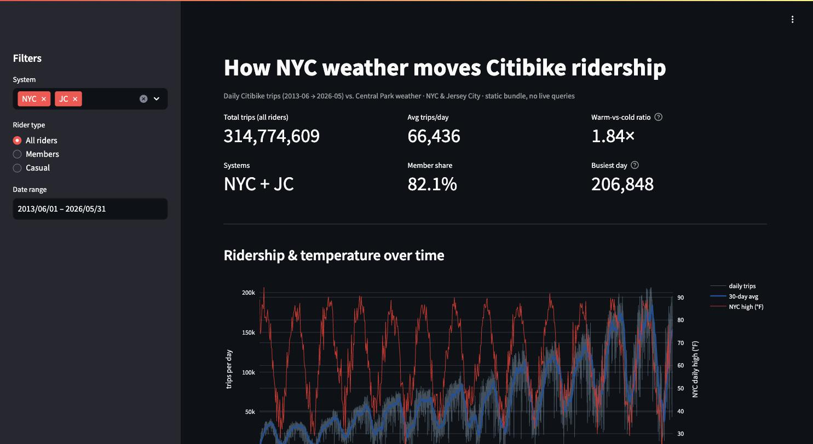
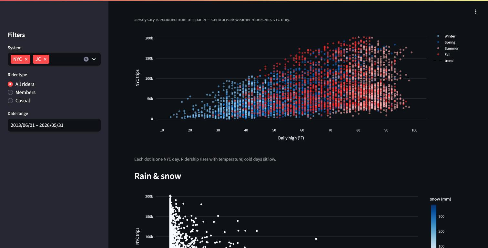
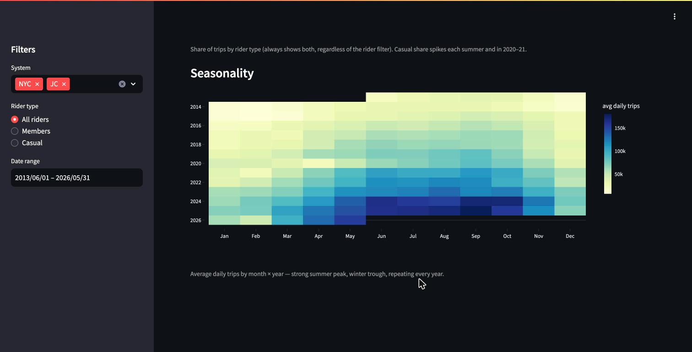

# Citibike Weather Pipeline

**The problem.** A city planner or a journalist wants to know how much New York
weather moves bike ridership. The answer is buried in 169 zip files, thirteen
years of Citibike trips in two different schemas, with months stored twice and
a weather archive that mixes units.

**The decision.** Land every file as text, untouched, into two raw tables split
by schema era. Interpret once, in a single audited view. Reconcile everything to
one number from three independent directions before believing it. Serve the
result as a static bundle so the public dashboard makes zero queries and can
never run up a bill.

**The result.** 314,774,609 trips, 2013-06 to 2026-05, zero timestamp parse
failures. Warm days carry 1.84x the ridership of cold days; members are 82.1% of
trips; the 2021-02-01 nor'easter (376 mm of snow) sits at the bottom corner of
every chart. And a data-quality catch that mattered: the first full load
silently doubled 2013 and 2018, and the fix is documented below.

**Built by** Emanuel Medina Pinzon, individual coursework for *Dealing With Data*
(Prof. Panos Ipeirotis), NYU Stern MSBAi, July 2026.



**Run the checks (Python 3.12+):** `pip install -r requirements.txt && pytest` · **Run the dashboard:** `streamlit run app/app.py`

---

## What the dashboard shows

The screens below are captures of the deployed app before its cloud project was
retired. The app itself still runs locally from the committed data bundle, no
account needed.

 

---

## The pipeline

```
Citibike public archive (169 zips, S3)
  |
  ingest/ingest.py     extract, restage as CSV + provenance, gzip, upload to GCS
  |                    HARD field-count gate; de-dup rule for months stored twice
  bq load (free)       two raw tables, all STRING, split by schema era
  |                      trips_legacy  15 columns, 2013 -> NYC 2019 / JC 2021-01
  |                      trips_new     13 columns, NYC 2020 -> / JC 2021-02 ->
  sql/trips_clean.sql  the one place interpretation happens: types, unions,
  |                    surrogate ride_id for legacy rows, DATETIME in local time
  sql/daily_summary.sql          one row per day x system (8,634 rows)
  sql/weather.sql                Central Park, from bigquery-public-data.ghcn_d
  sql/daily_summary_weather.sql  LEFT JOIN with the NYC predicate in the ON clause,
  |                              so Jersey City keeps NULL weather rather than a proxy
  app/data/*.parquet   the static bundle (267 KB). The app reads only this.
```

Every step, its reasoning and its trade-off is in [`DECISIONS.md`](DECISIONS.md).
The dashboard specification, with the numbers it has to show, is in [`SPEC.md`](SPEC.md).

## The number, three ways

`sql/verification.sql` reconciles the total from three independent angles and
they all agree:

| angle | values | sum |
|---|---|---|
| by schema era | 93,647,081 legacy + 221,127,528 new | 314,774,609 |
| by system | 308,193,797 NYC + 6,580,812 JC | 314,774,609 |
| by rider | 258,410,354 member + 56,311,978 casual + 52,277 unknown | 314,774,609 |

An independent per-month completeness check against the archive listing is in
[`sql/verification_independent_result.md`](sql/verification_independent_result.md).

## What went wrong, and what came out of it

**The double count.** The first full load reconciled perfectly, staged bytes
against loaded rows, and was wrong. The `2013` and `2018` archives store every
month twice: once as a whole-month CSV and again as size-split parts in a
subfolder, under different filenames. Both copies were staged and both were
loaded, so both sides of the reconciliation carried the duplicate. 2018 read
35,096,678 trips; the true figure is 17,548,339.

The fix is a name-only rule in the ingest (a whole-month file wins over that
month's split parts) plus a content hash on same-named members. The lesson is
in the tests: `test_2013_and_2018_are_not_double_counted` pins the corrected
values, and it was proved to go red by doubling 2018 in the bundle (3 tests
fail) before the bundle was restored. The original run logs were not kept; the
numbers above are the record.

**Snow in whole millimetres.** GHCN stores temperature and rain in tenths but
snow in whole mm. Dividing everything by ten turns the 2021 nor'easter into a
37.6 mm flurry. Pinned by `test_snow_is_whole_millimetres_not_tenths`.

**Fractional seconds.** 2018-2019 timestamps carry fractional seconds; the first
parse missed them and produced 39.2 million null timestamps. One extra format
in the `COALESCE` took it to zero.

## Run it without the cloud

```bash
# Python 3.12 or newer
pip install -r requirements.txt
pytest                        # 6 tests, under a second, against the committed bundle
streamlit run app/app.py      # the dashboard, on localhost, no credentials
```

The tests pin the things that would be expensive to get wrong: the reconciled
total, the two systems, the de-duplicated years, the snow units, the NULL weather
for Jersey City, and the date span.

## Re-running the pipeline

Only needed if you want to rebuild the bundle from source. You need a GCP project
with BigQuery and a GCS bucket; copy [`.env.example`](.env.example) to `.env` and
set your own project id. `ingest/ingest.py --list` prints the manifest without
touching anything. Two cost guards were in place for the original build and are
worth keeping: a per-query cap of 200 GB (`maximum_bytes_billed`) and a
notification budget on the project. Every build query stayed well under the cap
(the job statistics were not committed; the SQL that ran is).

## What this is not

- **Not a live service.** The Cloud Run deployment was retired in September 2026
  so that nothing here depends on a bill. The captures above are what it showed.
- **Not causal.** Weather and ridership move together; the dashboard makes no
  claim beyond that.
- **Jersey City has no weather analysis**, on purpose. Central Park is not
  across the river.

## Data

Citibike system data, public archive at `s3.amazonaws.com/tripdata`. Weather from
NOAA GHCN-Daily via `bigquery-public-data.ghcn_d`, station USW00094728 (Central
Park), QC-passed rows only. No personal data: the legacy schema's birth year and
gender columns are carried through the clean view and never analysed. Terms of
each source in [`LICENSES.md`](LICENSES.md).

## Built with

Python, BigQuery, Google Cloud Storage, Streamlit, Plotly, pandas, pyarrow.
Built with the Claude Code CLI in a pull-request workflow; the git history is the
audit trail.
